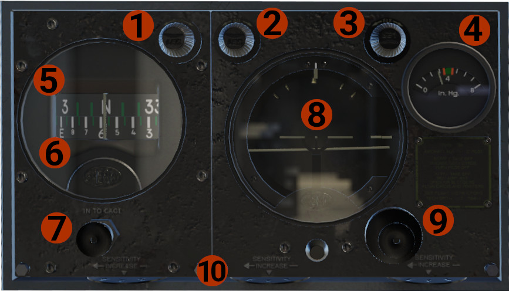
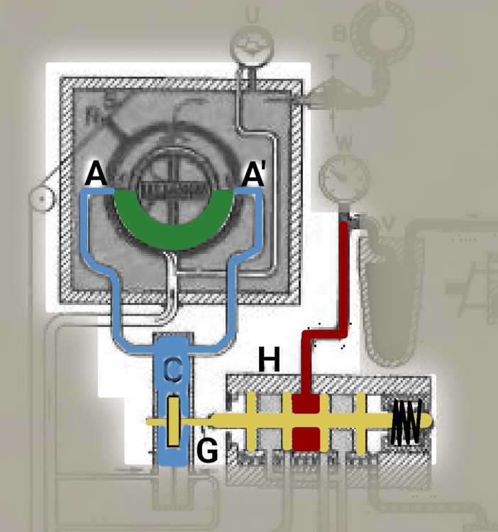
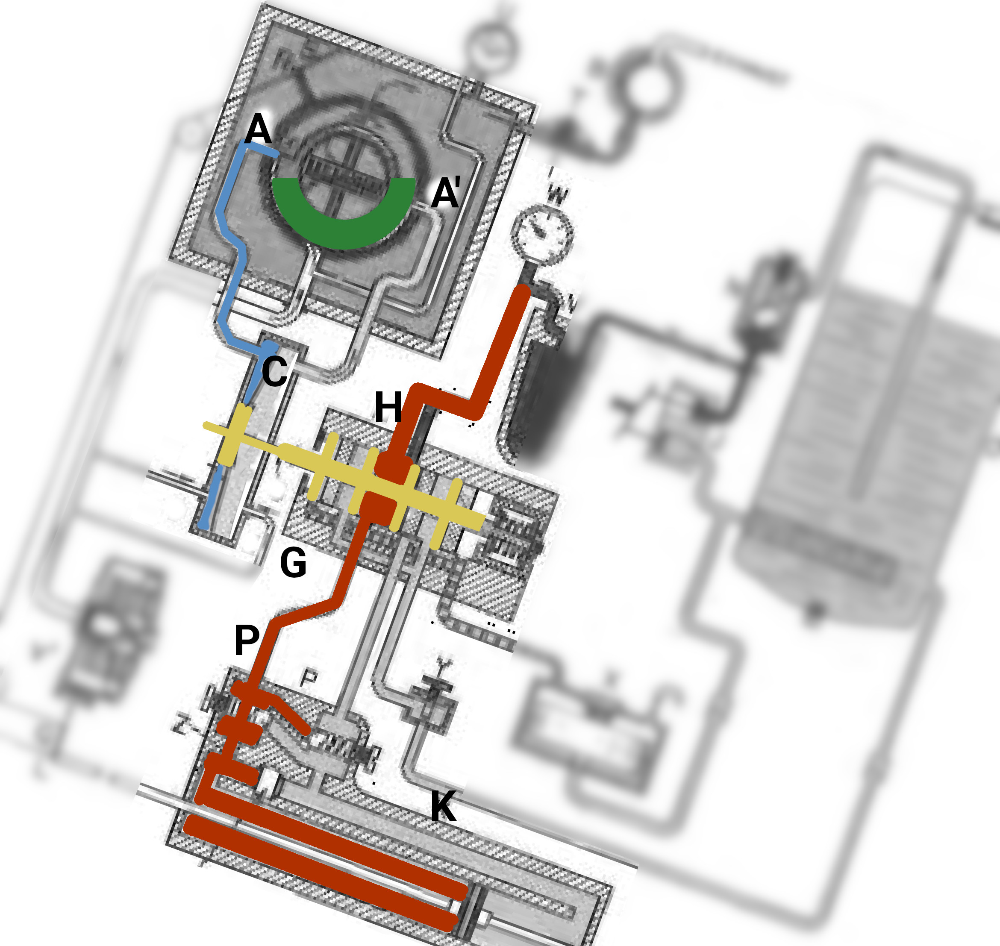

# Sperry A-3A Automatic Pilot

## History
The original DC-3 was equipped with the Sperry Type A-3A Automatic Pilot, a 1930’s system. 
The automatic pilot, is based on pneumatic (or electric) operation, was developed to correct the angular deviations from straight and level flight, 
so WWII era bombers (like the B-17 Flying Fortress) become somewhat stable platforms for weapons (bombs) delivery.

## Operation
The A-3A had the ability to maintain aircraft's attitude, keep a heading, and also make some adjustments
For our simulation, and taking in mind the very restrict capabilities, we designed 2 versions, the first is working in a "simplified way", 
and the other simulates the original autopilot.

## Simulated Sperry A-3A Automatic Pilot
!!! hint "INFO"
    This is the "simplified" version, that utilizes X-Plane's autopilot system to work, though it was customized to represent an operation close to the original.

### Overview

1. **RUD** knob: Controls the Rudder Follow-Up Card (upper card, #5).
2. **AIL** knob: Controls the Aileron Follow-Up index (top of the artificial horizon, #8).
3. **ELE** knob: Controls the Elevator Follow-Up index (right side of the artificial horizon, #8).
4. Autopilot system vacuum pressure.
5. Rudder Follow-Up Card.
6. Directional Gyro Card.
7. Caging Knob: Push to cage, and then rotate to match wet compass.
8. **Artificial Horizon:** Includes:
    - Top side: Bank index and Aileron Follow-Up index.
    - Right side: Elevator index and Elevator Follow-Up index.
    - Middle: Miniature airplane and Horizon dial.
9. Caging knob.
10. Valve Speed Controls: Determine the responsiveness of the automatic pilot. *Not simulated.*

### Operation

!!! attention "CAUTION"
    Prior engaging the Automatic Pilot, make sure that the aircraft is in straight and level path, and trimmed.
    Also, the Aileron and Elevator Follow-Up indexes, must be aligned with the artificial horizon attitude, to avoid
    abrupt movement of the aircraft.

- Before take off, make sure that the DG card is matched with the wet compass.
- After take off and at a safe altitude, level the aircraft, and trim, before autopilot engagement.
- Align the aileron and elevator follow-up indexes.
- Turn autopilot on, but hold the controls, until you feel that the aircraft is stable.
- In that mode, the aircraft is in "pitch and roll" hold mode. Now you can use aileron and elevator knobs to turn, or climb/ descend.
- You can also enable the "heading" mode. To do so, prior autopilot engagement, align the rudder follow-up card with the DG card, and then engage the autopilot.
If the engagement happen within couple degrees, you are in heading mode, though there is no annunciation.
- In heading mode, use the rudder knob to set the desired heading you want, for the aircraft to follow.
- Disengage the autopilot at a safe altitude, before final approach.
- With autopilot engaged is possible to use, if needed, the trims. Moving the controls, a bit more than normal, will simulate overpowering the autopilot.
Keep in mind, that the autopilot will not disengage, and will try to return to the previous attitude, before your actions!

## Sperry A-3A Automatic Pilot
!!! hint "INFO"
    This is a simulation based on the original Sperry A-3A version. Not all parts are simulated. The complete simulation will be available in a future update.

### Theory Of Operation

The principal of operation is the balance between 2 vacuum ports. When a follow-up index is aligned with the respective bank or roll index, then the vacuum pressure between the 2 ports is equal (balanced).
If there is a misalignment, then the vacuum pressure in not equal (imbalance) and the autopilot will act to correct this. In the example bellow, the roll axis will be described. The same applies to the pitch axis.

1. **Balanced Position:** The vacuum pressure between **A** and **A'** is equal, as the pressure inside the diaphragm **C**, through the vacuum tubes (cyan color).
**C** is connected to the piston **G**, which moves inside the manifold **H**. In this position, the hydraulic pressured fluid remains inside the manifold, and no pressure moves towards the aileron pistons.

    

2. **Imbalanced Position:** In an imbalanced situation, the green diaphragm blocks one of the ports (**A'**), removing the vacuum from the on side, while is wide open on the other side (**A**). 
This moves the diaphragm **C** to the one side. Since it is connected to the piston **G**, the piston is moving as well, letting hydraulic fluid to pass through the pipe **P**,
to the one side of the piston **K**, moving the connected ailerons. This will continue until the **A'** port is unblocked, and the vacuum is balanced again between **A** and **A'**.

### Operation
The operation is the same as with the Simulated Sperry A-3A Automatic Pilot, as described above. There are though some differences. Because all the actions are purely mechanical, they are not filtered through any logic. In case of engaging the autopilot in an unbalance position (big difference between follow-up index and respective bank or roll index), a violent movement might occur. To avoid this, make sure that all indexes are aligned. In heading mode, as described above, when the autopilot engagement occurs with the rudder follow-up card with the DG card aligned, the aircraft will remain at the current heading. The AIL knob is disabled, and the RUD knob is used to correct heading by few degrees, by moving slightly the rudder.

Currently, the **heading mode** is not available. Aircraft heading and attitude control is accomplished using the **AIL** and **ELE** knobs. The **RUD** knob is non-functional.

!!! note "DEVELOPER'S NOTE"
    As you might have noticed, the autopilot is capable to provide some attitude hold capabilities, but nothing much more. Speaking with a few pilots who have flown aircraft with this autopilot, the common ground was that barely ever used,
    since DC-3 is quite stable in flight, and in calm weather, it is easy to hold the attitude, just by trimming the aircraft. In general was the hardest system to gather information, since almost all the flying DC-3s are retrofitted with more modern equipment. 

