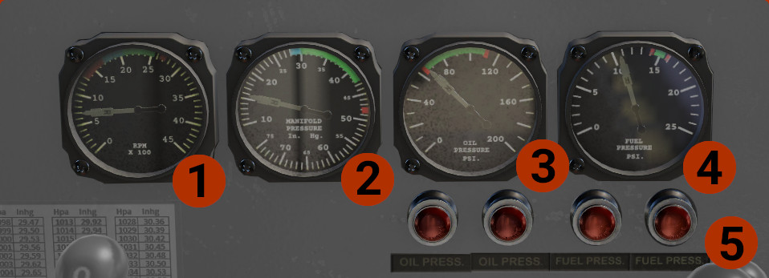
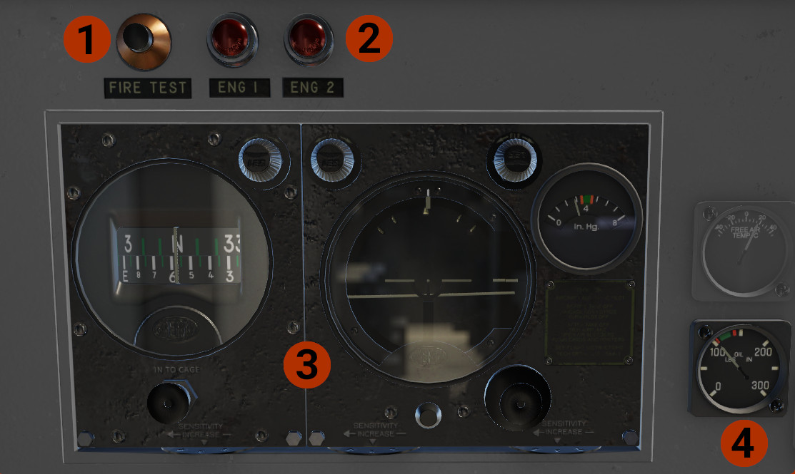

# Center Panel

## Lower Panel
On the lower center panel are the main engine instruments.

1. **Engines RPM**: Indicates the rpm for each engine. Some values you must have in mind:
      - For take off only, set 2700 RPM.
      - After take off, for climb out, reduce RPM at the top of green area, ~2550 RPM.
      - As you climb, above 5-6,000 ft, reduce even more, as required.
      - Keep the engine around 1000 RPM, for warm up.
2. **Manifold Pressure**: Values to have in mind:
      - For take off, set the power at the top of green area. If heavy take off weight or/and short runway, you can set more power, but in any case below the red line!
      - For climb, set power at 40-42 inHg.
3. **Engine Oil Pressure**: Indicates the oil pressure, per engine. Critical to keep the needles inside the limits.
4. **Fuel Pressure**: Indicates the fuel pressure at the carburetors, per engine.
5. **Annunciator**: Indicate if a pressure (oil or fuel), is not within operating limits. Rotate each light to adjust brightness.

## Upper Panel

1. **Fire Test**: Press the button to test the fire alarm system, lights (#2) and bell ring. Requires at least battery power.
2. **Fire Alarm Lights**: Indicate if a fire is sense in one of the engines. Rotate the light to adjust brightness.
3. **Sperry A-3A Automatic pilot**: Read detailed description and operation on the [Automatic pilot](autopilot.md) page.
4. **Oil Pressure**: Indicates the oil pressure for the autopilot.