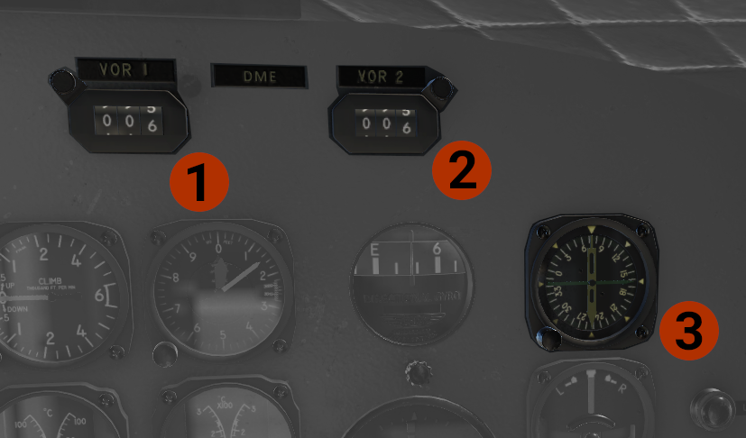
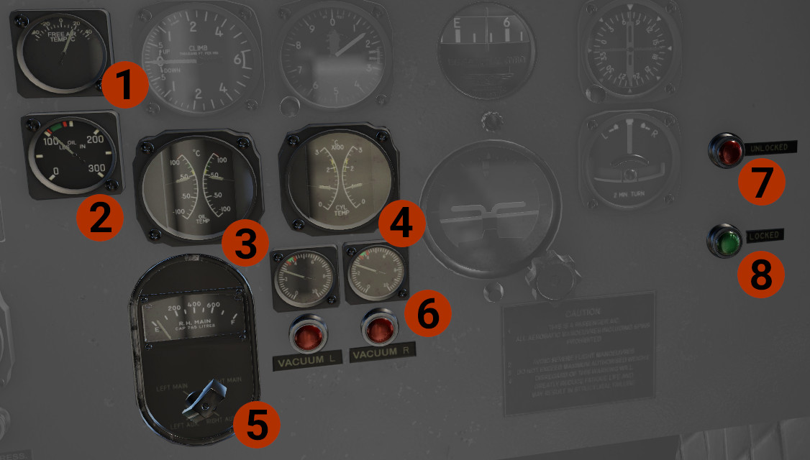

# Copilot's Panel

## Copilot's... five-pack!
On the copilot's side there is no airspeed indicator

1. **Vertical Speed Indicator** (VSI).
2. **Altimeter**: If you get barometric pressure in hPa, there is a placarded conversion table at the bottom of pilot's side panel. You can click it to pop out.
3. **Directional Gyro**: Press the knob to CAGE the instrument, and then rotate the knob, to match wet compass.
4. **Artificial Horizon**: Press the big knob to cage the instrument. Use the small knob to adjust miniature wings position. The aircraft on the ground sits at an 11o up attitude.
5. **Turn and Slip Indicator**.

## Copilot's Navigation Instruments

1. **VOR 1 DME**:Bearing indications in the pilot's RMI.
2. **VOR 2 DME**. 
3. **RMI**: The copilot's side RMI has 2 needles.
    - The #1, green, needle shows the bearing to the ADF 2 tuned station.
    - The #2, white, needle shows the bearing to the VOR 2 tuned station.

## Copilot's Side Other Instruments

1. **Free Air Temp**.
2. **Oil Pressure**: Indicates the oil pressure for the autopilot.
3. **Oil Temperature**: Indicates the oil temperature for each engine.
4. **CHT Temperature**: Indicates the cylinder head temperature for each engine.
5. **Fuel Qty**: Indicates the fuel quantity of each tank, in liters. Used the knob to switch between the tanks.
6. **Vacuum Press**: Two indicators of each vacuum system.
7. **Unlock light**: Indicates that the landing gear is in a not safe position. Rotate the light to adjust brightness.
8. **Lock light**: Indicates that the landing gear is down and locked. Rotate the light to adjust brightness.