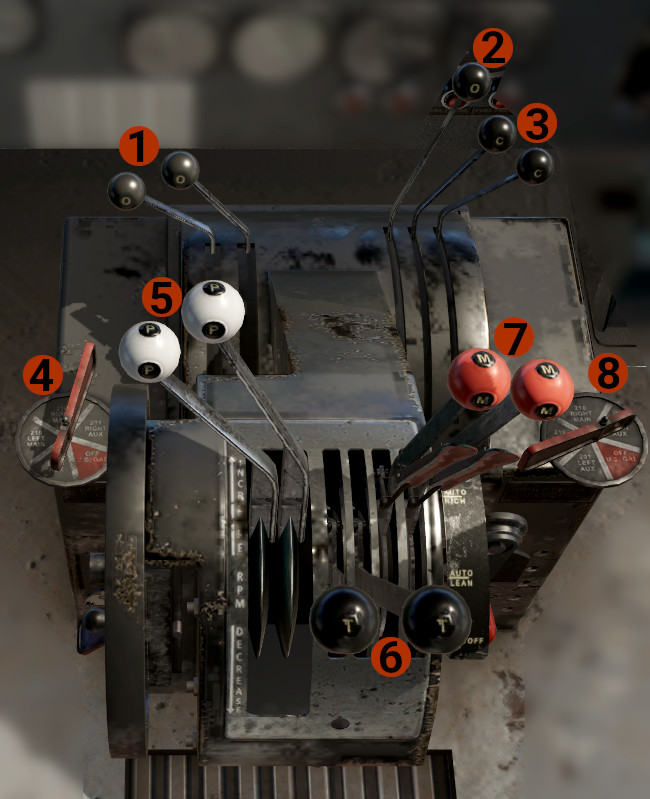
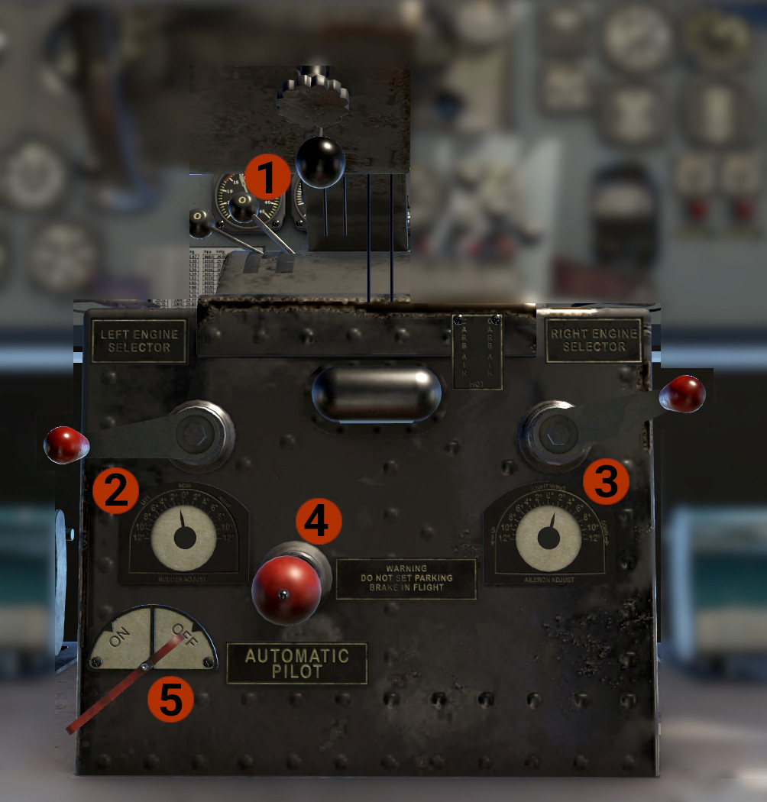

# Pedestal

## Top View

1. **Oil Cooler Levers**: One per engine, forward closed, aft opened. Moving the lever(s) aft, will open a flap in front of the oil cooler, to allow ram air to cool the oil.
If the oil temperature gets high, open as need for the temperature to drop at normal levels.
2. Carburetors Heat Levers Friction: It is animated, but have no effect.
3. **Carburetors Heat Levers:** One per engine, forward closed, aft opened. Use them if you suspect that ice might form on the carburetors.
4. **Left Engine Fuel Tank Selector:** Select which tank will feed the left engine.

    !!! note "NOTE"
        The aircraft does not have crossfeed capabilities. It is possible to feed each engine from any tank.

    !!! attention "CAUTION"
        For take off and landing, ALWAYS select the fullest tank.

5. **Propeller Control levers:** Use to control engines speed.
6. **Throttles:** Use to control engines power.
7. **Mixture Controls:** Control the mixture for each engine. The levers have 4 distinct positions. To move them, first click on the pad, and them move them to the desired position.
    - **IDLE - CUT OFF:** Does not allow fuel to the engines.
    - **AUTO LEAN:** Automatic fuel control, lean position. Use at cruise.
    - **AUTO RICH:** Automatic fuel control, rich position. Use for all flight phases.
    - **EMERGENCY:** Sets, manually, mixture to full.
   
    !!! hint "INFO"
        The mixture control system, for the AUTO RICH and AUTO LEAN positions, achieves automatic control via a bellows system with trapped atmospheric pressure of 28 inHg. 
        As the altitude increases and the outside pressure drops, the bellows inflate, restricting gradually the fuel, thus leaning the mixture.

8. **Right Engine Fuel Tank Selector:** Select which tank will feed the right engine. The same as the left one.

## Bottom view

1. **Tail Wheel Lock Lever:** Forward unlock, aft, lock.
2. **Rudder Trim Handle & Indicator.**
3. **Aileron Trim Handle & Indicator.**
4. **Parking Brake:** Pull to set, forward to release.
5. **Automatic Pilot On/Off Handle:** Engage or disengage the autopilot. Read about the autopilot, on the [Automatic Pilot](autopilot.md) page.