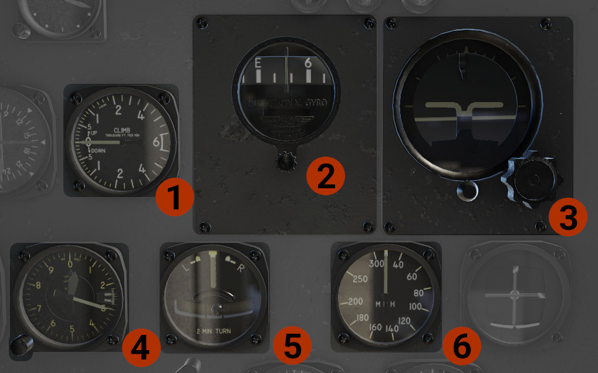
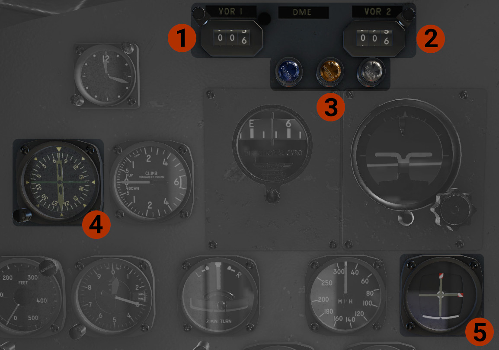
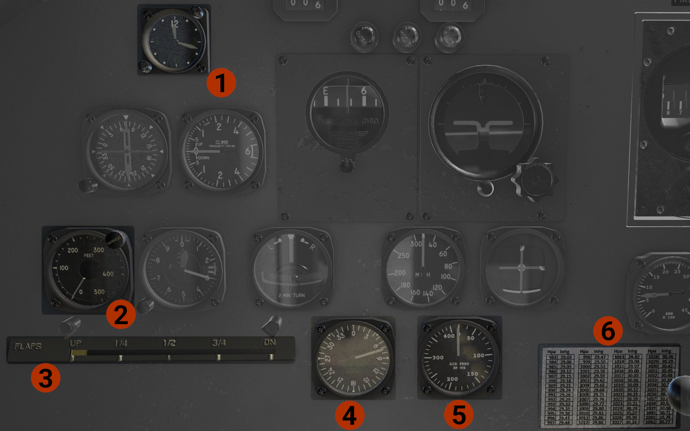

# Pilot's Panel

## Pilot's "Six- Pack"

1. **Vertical Speed Indicator** (VSI).
2. **Directional Gyro**: Press the knob to CAGE the instrument, and then rotate the knob, to match wet compass.
3. **Artificial Horizon**: Press the big knob to cage the instrument. Use the small knob to adjust miniature wings position. The aircraft on the ground sits at an 11o up attitude.
4. **Altimeter**: If you get barometric pressure in hPa, there is a placarded conversion table at the bottom of pilot's side panel. You can click it to pop out.
5. **Turn and Slip Indicator**.
6. **Airspeed Indicator**: In MPH. Vne = 205 MPH.

## Pilot's Navigation Instruments

1. **VOR 1 DME**.
2. **VOR 2 DME**: Bearing indications in the copilot's RMI.
3. **Marker Beacons**: From left to right, Outer, Middle, and Inner markers. By rotating them, you can adjust their brightness.
4. **RMI**: The pilot's side RMI has 2 needles.
    - The #1, green, needle shows the bearing to the ADF 1 tuned station.
    - The #2, white, needle shows the bearing to the VOR 1 tuned station.
5. **Glideslope Course Indicator**(GCI): Simulates the Weston Type 3Y2 CGI. Receives only ILS (LOC and GS) signals, if the VOR 1 radio is tuned into an ILS frequency.

## Pilot's Side Other Instruments

1. **Clock**: Shows local time. You can use the lower knob to change the time, and the upper knob to change it fast. A bit of... magic, right?
2. **Radar Altimeter**: Shows the aircraft's altitude above the ground. Has 2 scales. The first one is from 0 to 500 ft, and the second from 0 to 5000 ft. Use the knob to toggle between the two. When the instrument is in the second scale, a set of 0 will appear to display the correct altitudes.
3. **FLAPS**: Indicates the position of the wing flaps.
4. **Slaved Gyro Magnetic Compass**: Indicates aircraft's magnetic heading, without compass errors.
5. **Airspeed Indicator**: Backup airspeed indicator in knots.
6. **Baro Table**: Conversion table between inHg and hPa. Click it to get a pop out window.

