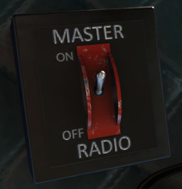
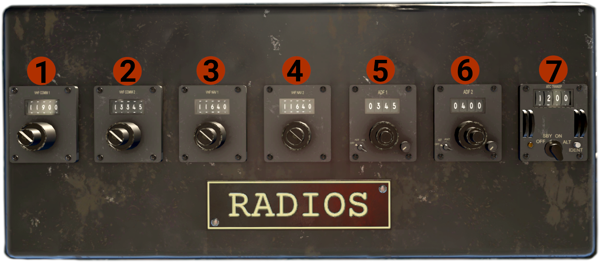

# Radios

## Master Switch
The Master Radio switch is located on the cockpit ceiling, on the left side of the radio stack, and controls the power to the radio stack.

## Radio Stack
The radio stack is located above pilots heads, on the cockpit ceiling.

1. **VHF COMM 1 radio**: Has 2 rotary knobs. The big controls the frequency MHz, and the small one the frequency KHz. The small flatheaded knob, is the volume control for the radio.
2. **VHF COMM 2 radio**: Same as VHF COMM 1 radio.
3. **VHF NAV 1 radio**: Controls NAV 1 (VOR 1). Same controls as the COMM radios.
4. **VHF NAV 2 radio**: Same as VHF NAV 1 radio.
5. **ADF 1 radio**: 
    - On the left is the MODE knob, with 3 positions: OFF - ADF - ANT. Turn the knob to ADF to have indications in the RMI.
    - In the middle there are 3 frequency control knobs. The top controls 1s KHz, the middle 10s KHz, and the bottom 100s KHz.
    - On the right side is the volume control.
6. **ADF 2 radio**: Same as the ADF 1 radio.
7. **Transponder**: 
    - Has 4 knobs, 2 left and 2 right, each one controls the respective transponder digit.
    - Middle-bottom is the MODE knob, with 4 positions: OFF - SBY - ON - ALT. The ALT position is the same as ON, since this aircraft has not altitude reporting altimeter.
    - On the left bottom side is the ID indicator (light).
    - On the right bottom side is the IDENT button.