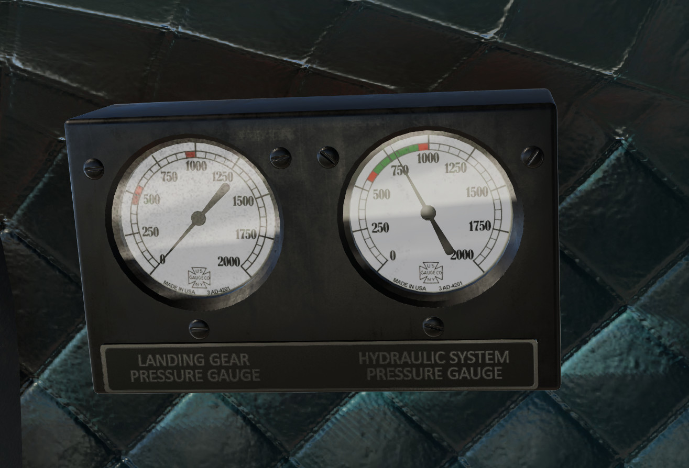
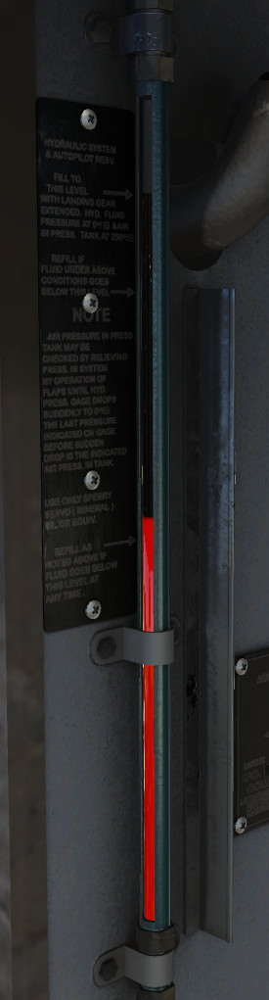
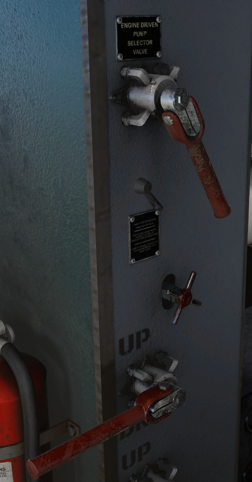
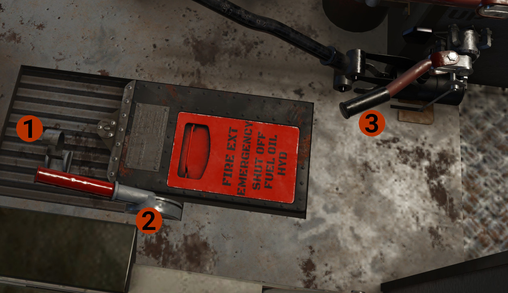

# Hydraulic System

## Overview

The hydraulic system operates the landing gear, brakes, wing flaps, automatic pilot, and windshield wipers.
The hydraulic system operates on 675-925 pounds per square inch pressure supplied by an engine-driven hydraulic
pump on each engine. Each engine provides pressure to the one of the 2 systems. The selected system provides pressure to all systems, and the non-selected to automatic pilot.

!!! hint "INFO"
    All controls are fully mechanical and there is nothing automated. For example, to lower the flaps,
    you move the flaps lever to down position. This level is the actual valve that allow hydraulic pressure to move to the one side
    of the flaps' cylinder, extending the flaps. As you keep the level down, the flaps will continue to move until reach the full down position.
    If you want to deploy less flaps, monitor the flaps indicator, and as soon the flaps reach the desired position, move the flaps handle to center position. 

The landing gear pressure cage shows hydraulic pressure to landing gear during extension. 
The system pressure shows the hydraulic pressure of the selected hydraulic system.

Shows the quantity of the hydraulic oil.

the Pump Selector Valve controls which engine's pump provide hydraulic pressure to the main hydraulic system.
Aft for the left engine and forward for the right engine.

The handle at the bottom of the above image is the flaps control level. Move up to retract flaps, and down to extend them.

The knobs between are not simulated.

!!! info "DEVELOPER'S NOTE"
    The system is not fully simulated, but we are planning to do this in a future release.

## Landing Gear Controls

1. **Safety Clip:** Keeps the Latch Control Handle in down position.
2. **Latch Control Handle:** Spring-loaded to MID position. Locks the landing gear handle not to move to up position, by mechanical means. 
3. **Landing Gear Control Valve Handle:** Controls the retraction or extension of the landing gear.

### Landing Gear Retraction
When the aircraft is on the ground and before take off, the landing gear handle should be in the neutral position, the latch handle down and secured by the safety clip.
After take off to raise the landing gear:

1. Remove the safety clip. The latch handle will move to the middle position.
2. Raise the latch handle to upper position.
3. Raise the landing gear handle to the upper position.
4. When the UNLOCK (red) light is extinguished, indicating that the landing gear is up, move the landing gear handle to the middle position. The latch handle will drop to the middle position.

### Landing Gear Extension

1. Move the landing gear handle to the down position.
2. When the landing gear is down and locked, indicated by the illumination of the LOCK light, move the latch handle down and enable the safety clip.

    !!! info "TIP"
        To be able to accomplish the above #2 in X-Plane, we have reversed the order. Enable first the safety clip, and then move the latch handle full down.

!!! info "INFO"
    Beyond the above landing gear safety mechanisms, the aircraft is also equipped with squat switch, which prevents the landing gear to be retracted when there is weight on the landing gear.