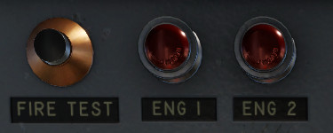
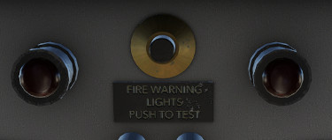
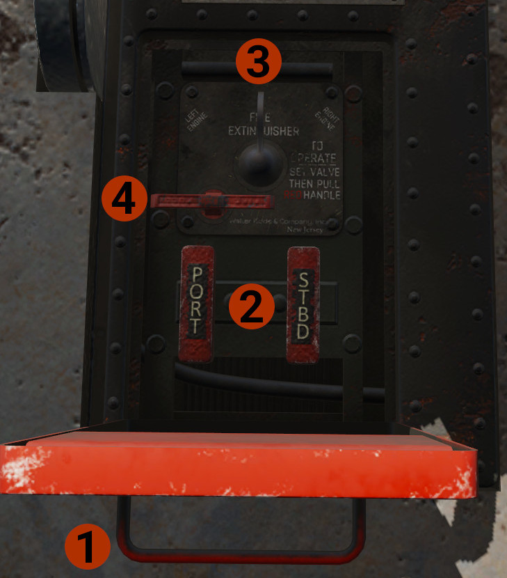
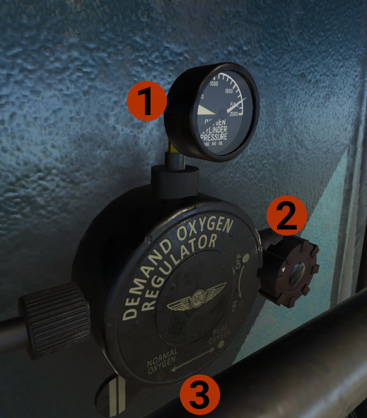
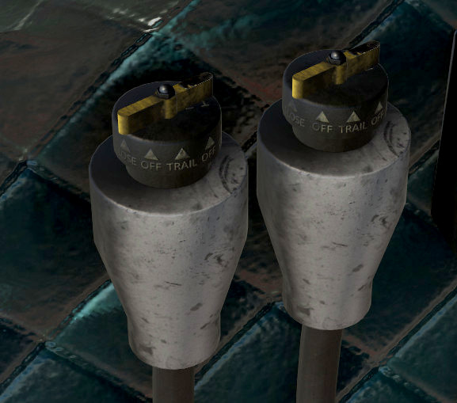
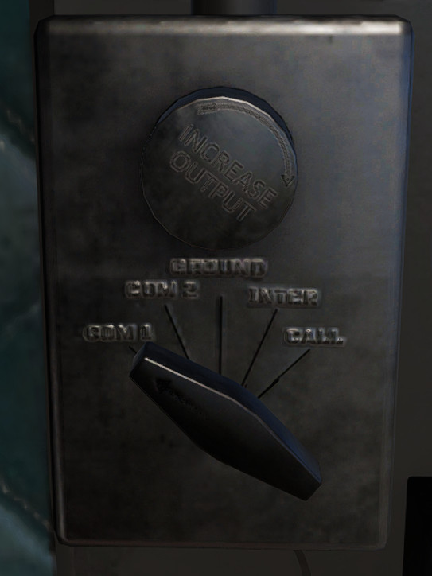
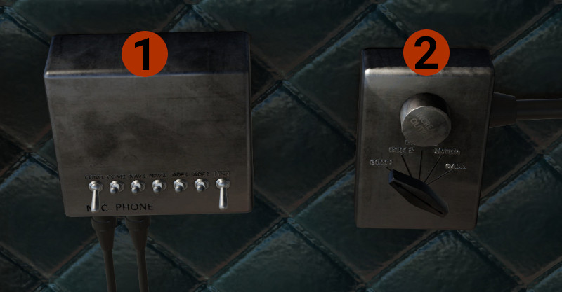

# Other Systems
You will find here information about other systems.

## Fire Engines Alarm and Extinguish

### Annunciators
Each aircraft has, on the center panel, 2 lights that indicate fire in the perspective engine.

*Classic aircraft Fire Lights*

*Modern aircraft Fire Lights*

Press the button to test if the lights illuminate and the fire bell works. Turn the lights to adjust their brightness.

### Fire Extinguish Panel

The panel is located on the cockpit floor, between pilots' seats.

In case of fire:

1. Click the **cover handle** to open the panel.
2. Turn outwards the fuel cut off valve for the engine on fire. **PORT** for the left engine, **STBD** for the right engine.
3. Turn the **FIRE EXTINGUISHER VALVE** towards the engine on fire.
4. Pull the **FIRE EXTINGUISHER HANDLE** to stop the fire.

## Oxygen System

!!! hint "INFO"
    DC3 is not a pressurized aircraft, and the oxygen is provided manually for the occupants. 
    We provide a basic oxygen system simulation for the pilot.

The controls and indicator for the **Oxygen Demand Regulator** are located behind pilot's seat.

1. **Oxygen pressure indicator:** Indicates the current pressure of the oxygen cylinder, that provides oxygen to the pilot.
2. **Control Knob:** Allows oxygen from the cylinder to be directed to pilot's oxygen mask (not simulated).
3. **Oxygen Regulator Diluter Lever:** In the **NORMAL OXYGEN** position provides the correct mixture between air and oxygen. 
The **PURE OXYGEN** position provides 100% oxygen to the pilot.

!!! danger "WARNING"
    In the **PURE OXYGEN** position, the oxygen consumption is very high. If needed, while flying at high altitude, use this position until you descend to a lower altitude.

## Cowl Flaps Controls

The cowl flaps controls are located on the right side of the cockpit next to copilot's seat. The forward is for the left angine, and the aft for the right engine.
They have 5 positions.

1. **CLOSE:** Commands the cowl flaps to fully close position.
2. **OFF:** This is an intermediate position between **TRAIL** and **CLOSE**, and stops the flaps at the position they are when the lever is set to OFF.
3. **TRAIL:** In this position, the cowl flaps are set to a spring-loaded to open position. At 0 knots they are fully open, and as the airspeed increased, drag from the air, starts closing them.
They are becoming fully closed at around 120-130 knots. The same as you decelerate below this airspeed, they start open again.
A good use of this position is if you take off (or land) and the ambient temperature is high, allows the engine to cool when the airspeed is low, but close when there is enough ram air to cool the engine.
4. **OFF:** Same as above.
5. **OPEN:** Commands the cowl flaps to fully open position.

!!! attention "CAUTION"
    Use the cowl flaps to keep engine temperature in normal range, but keep in mind that they add drag when open, and will slow down the aircraft.

## Audio Panels

**Pilot's Controls:** The **INCREASE OUTPUT** knob controls the audio level of all radios. The selector knob, controls which radio will transit. Positions other than COM1 and COM2, there is no radio transmission.

1. **Audio Panel:** Selects which radios you will listen. On position is down.
2. **Copilot's Controls:** Same as the Pilot's Controls above, but for the copilot.

## Tablet (Avitab)

You can enable, through the setting menu, to have the tablet on the middle windshield pilar. The tablet is powered via its own battery, which is fully charge every start.

The tablet gives you full access to all Avitab's functions. Push tablet's button to return to avitab's home page.

You can move the tablet, by grabbing the top, left, right, up, and down.

At the bottom, you have some extra info. Current Lat/Lon location, ground speed, GPS altitude, and current track.