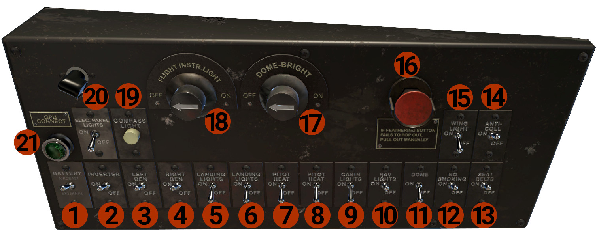
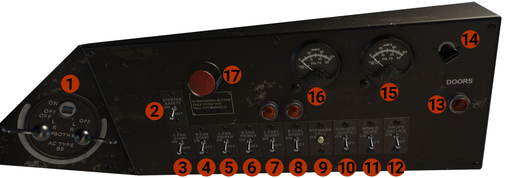

# Overhead Panels

Two overhead panels are located on the ceiling of the cockpit, and towards the front windshield. Between the 2 panels is the Magnetos controls.

## Left Overhead

1. **BATTERY**: Has 3 positions:
    - AIRCRAFT: In this position, the aircraft batteries are connected and provide DC power to the aircraft.
    - OFF: Batteries are disconnected from the DC bus.
    - EXTERNAL: In this position, the batteries are disconnected, and the aircraft can receive DC power from the GPU.
2. **INVERTER**: Provides AC power to instruments (RMIs).
3. **LEFT GEN**: Connects the left engine DC Generator to DC BUS.
4. **RIGHT GEN**: Connects the right engine DC Generator to DC BUS.

    !!! note "NOTE"
        On the generator circuitry, a cutoff relay is installed. This relay prevents the generator to be connected on the DC Bus, if the output voltage is below 17VDC, despite switch position.

5. **LANDING LIGHT**: Controls the left landing light, located on the leading edge of the left wing.
6. **LANDING LIGHT**: Controls the right landing light, located on the leading edge of the right wing.
7. **PITOT HEAT**: Controls the pilot's side pitot heater.
8. **PITOT HEAT**: Controls the copilot's side pitot heater.
9. **CABIN LIGHTS**: Controls the ceiling lights, in the passenger cabin.
10. **NAV LIGHTS**: Controls aircraft's position lights.
11. **DOME**: Enables the DOME-BRIGHT knob (#17), that controls the ceiling cockpit lights.
12. **NO SMOKING**: Controls the NO SMOKING annunciator, in the passengers' cabin.
13. **SEAT BELTS**: Controls the SEAT BELTS annunciator, in the passengers' cabin.
14. **ANTI-COLL**: Controls aircraft's strobe lights.
15. **WING-LIGHTS**: Controls the 2 wing inspection lights, located on the outboard side of each engine nacelle.
16. **FEATHER button**: Press the button to feather the left propeller. The button will stay in, while the propeller is feathered. 
When the propeller reaches the feathered position, the button will pop out. To un-feather the propeller, press and hold the button. 
In case of feather system failure, the button will remain in. You should manually pull the button out (press and hold).
17. **DOME-BRIGHT**: Turn the knob to control the brightness of the ceiling lights. Requires DOME switch (#11) to be on.
18. **FLIGHT INSTR.LIGHT**: Controls the instrument lights.
19. **COMPASS LIGHT**: Controls the wet compass light.
20. **ELEC. PANEL LIGHTS**: Controls the 2 lights for the overhead panels, one for each panel.
21. **GPU CONNECT**: Indicates that the GPU is connected and provides power. Turn the light to control brightness.

## Right Overhead
Includes the Magnetos Control Panel.

1. **Magnetos Control Panel**: Has 3 controls.
      - MAIN SWITCH: Turn this switch off, grounds both magnetos, disabling them. Must be on for the magnetos to operate.
      - L/R Magnetos Controls: Controls the magnetos for each engine.
2. **STARTER SAFETY**: When is OFF, disables starters. Turn it ON when you want to start the engines.
3. **L ENG START**: Engages the left engine starter. 
4. **R ENG START**: Engages the right engine starter.
5. **L ENG PRIMER**: Turn on to prime the left engine. 
6. **R ENG PRIMER**: Turn on to prime the right engine. 

    !!! note "NOTE"
        You can start the engines, only with the primers on, and fuel boost pumps off.

7. **L FUEL BOOST**: Controls the left fuel boost.
8. **R FUEL BOOST**: Controls the right fuel boost.
9. **STEWARD CALL**: Chimes the Steward call bell.
10. **SURFACE BOOTS**: Controls wings' surfaces boots operation.
11. **WSHLD DEICE**: Removes ice from cockpit windshields.
12. **PROPS ANTI-ICE** Controls the engines' and propellers' anti-icing.

    !!! note "NOTE"
        DE-ICE and ANTI-ICE systems are not fully simulated, but we provide a basic operation for protection. The complete simulation will be released in a future update.

13. **DOORS**: Illuminates if a door is open. Rotate to adjust brightness.
14. Right Overhead panel light.
15. **RIGHT AMPS/VOLTS METER**: Show the total load (AMPS) on the right generator. Press the button at the left corner to display VOLTS.
16. **LEFT AMPS/VOLTS METER**: Show the total load (AMPS) on the left generator. Press the button at the left corner to display VOLTS.

    !!! note "NOTE"
        Those indicators show only generators' amps and volts, and not the load on the DC Bus.

17. **FEATHER button**: Press the button to feather the right propeller. The button will stay in, while the propeller is feathered.
    When the propeller reaches the feathered position, the button will pop out. To un-feather the propeller, press and hold the button.
    In case of feather system failure, the button will remain in. You should manually pull the button out (press and hold).