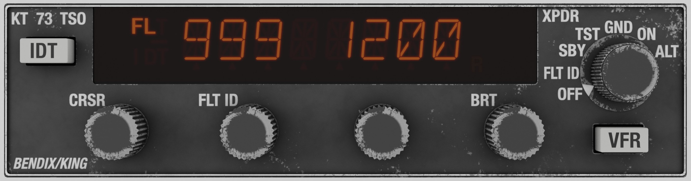

# Avionics

## Bendix/King KAP-140 Autopilot

We have installed the KAP-140 Two Axis with Altitude Preselect Autopilot System, coupled with the KI-525A HSI.
All operations described in the official manual are simulated, and we suggest for the better use, to download the manual from Honeywell site, by clicking the link below.

[KAP-140 Official Manual](https://www.bendixking.com/content/dam/bendixking/en/documents/document-lists/downloads-and-manuals/006-18034-0000-KAP-140-Pilots-Guide.pdf)

A few things to have in mind:

1. The autopilot co-operates with the HSI, and you should read in the manual about this arrangement. There are other arrangements that operate differently.
2. The autopilot has its own barometer, and set separately from the other altimeters. The barometer is initialized at 29.92 inHg.
3. 

## X-Plane's GNS530

X-Plane's GNS530 is installed to provided you the ability to fly your flight plans and executed various approaches, supported by the GPS.

The GNS530 controls COM1 and NAV1 radios.

Also, [RealityXP GNS530W](https://reality-xp.com/index2.html) is supported. Enable it from the Plugins menu, and use the controls in the 3D panel to operate it.

# Radios

We have installed 1 Com/Nav radio for the Com2 and Nav2 radios, 1 transponder, and 2 ADF radios for ADF1 and ADF2 respectively.
All radios are fully simulate the real world counterparts, so we suggest to read the official documentation from the link below.

[Official Documentation](https://www.bendixking.com/content/dam/bendixking/en/documents/downloads/006-18110-0000_5-Pilot-s-Guide.pdf)

## Bendix/King KX-165A Com/Nav Radio

Com Radio Characteristics: 

1. 8.33 kHz capability.
2. Active mode (the knobs control directly the active frequency).
3. Channel mode to select frequencies from radios non-volatile memory.
4. Program mode, to store your desired frequencies to the non-volatile memory.

Nav Radio Characteristics:

1. Active mode (the knobs control directly the active frequency).
2. OBS mode: Displays the lateral deviation relative the Nav2 tuned station, with the capability to set the desired course, both for VOR and LOC stations.
3. TO mode: Displays the TO radial to the Nav2 tuned station.
4. FROM mode: Displays the FROM radial from the Nav2 tuned stations.
5. Elapsed Timer and Countdown Timer.

## Bendix/King KT-73 Transponder

The KT-73 Transponder has the capability to report the altitude based on standard atmospheric pressure. 
The user does not have the ability to change it, but it is decoded appropriately at the ground stations.
The transponder's VFR code is factory set at 1200, which is what the unit is initialized when turned on.

1. **OFF:** Turns off the unit.
2. **FLT ID:** Initialized with the tail number stored in the airframe .ini file. Use CRSR knob to set the position, and then FLT ID knob to change the digit.
Digits start from 0 -> 9, then --, then A -> Z, and last digit is the space (empty).
3. **SBY:** Standby mode. In this mode you can change the stored VFR code. To do so, set the desired code, and then hold the VFR button for around 3 seconds.
This deviates from the real procedure a bit, because requires to press 2 buttons simultaneously.
4. **TST:** In this mode the unit does the self-test. When the test is finished, use the BRT knob to set unit's brightness.
5. **GND:** Use this mode on the ground.
6. **ON:** Use this mode before take off.
7. **ALT:** As the ON mode, but also transmits altitude information.

## Bendix/King KR-87 ADF Radios

The aircraft is equipped with 2 ADF radios, the top for ADF1, and the bottom for ADF2. 
Both support all operations of the real unit, including Flight Timer (FLT), Elapsed Timer (ET) and countdown timer.
