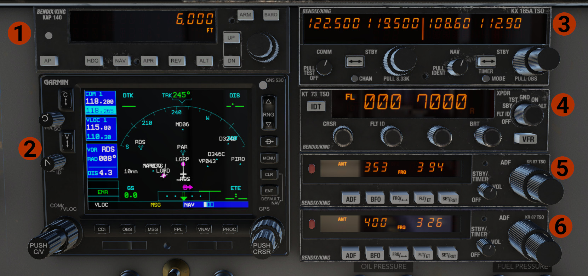

# Center Panel

## Avionics and Radios Stack

1. Bendix/King KAP-140 Autopilot.
2. GNS 530.
3. Bendix/King KX-165A Com/Nav Radio.
4. Bendix/King KT-73 Transponder.
5. Bendix/King KR-87 ADF (#1).
6. Bendix/King KR-87 ADF (#2).

For detailed information and operation, visit [Radios & Avionics](avionics.md) page.

## Lower Center Panel

1. **Fire Alarm & Test:** The lights indicate in fire is sensed in one of the engines. Press the button to test the lights and the alarm bell.
2. **Pressure Lights:** Indicate if a pressure (oil or fuel) is outside the limits.
3. **Engines RPM:** Set values as below:

    - For take off and landing, 2700 RPM.
    - For climb, after take off, on the top of the green range, around 2500-2550 RPM.
    - As you climb above 5-6000 ft, reduce as required.
    - Keep the engine around 1000 RPM, for warm up.

4. **Manifold Pressure:** For take off set power at the top of the green range. Depending on the conditions, only for take off can use more power, but never exceed the red line!

    !!! danger "WARNING"
        Advancing the throttles too fast, might induce excessive stress into the engine and propeller, which might result in engine catastrophic failure.

5. **Engine Oil Pressure**.
6. **Fuel Pressure**.
7. **Cylinder Head Temperature (CHT)**.
8. **Carburetors Temperature**.
9. **Engine Oil Temperature**.
10. **Flaps Indicator**.