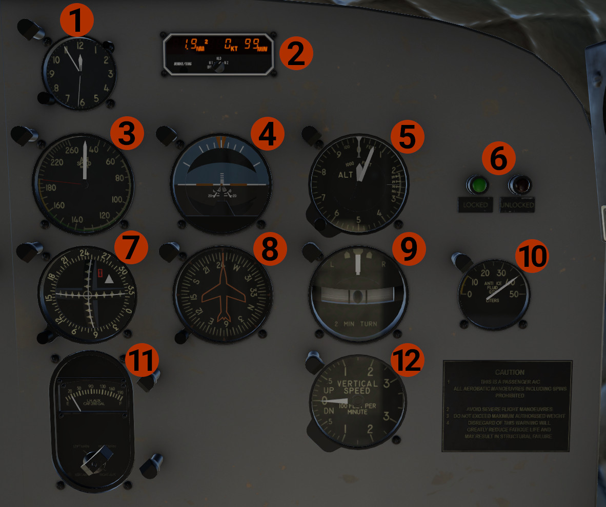

# Copilot's Panel

1. **Clock:** Shows the local time.
2. **KDI-572:** DME indicator for the pilot. Displays distance, speed, and time for the 2 Nav stations. Operation:
      Use the link for the [Official Documentation](https://www.bendixking.com/content/dam/bendixking/en/documents/downloads/006-08420-0003_3-kdi-572-pilot-guide.pdf).

    - **OFF:** Turns the unit OFF.
    - **N1:** Display data for NAV1 tuned station. Display dashes if no station is received.
    - **HLD:** When we turn the knob from N1 to HLD, tunes DME to the NAV1 radio and displays the NAV1 data.
      If we change frequency in the NAV1 radio, the DME will still display NAV1 data. The same will happen if we turn the knob from
      N2 to HLD, but for NAV2. When the HLD mode holds NAV1 data, **1H** is displayed, and when holds NAV2 data, **H2** is displayed.
    - **N2:** Display data for NAV2 tuned station.

3. **Airspeed Indicator:** In knots.
4. **Attitude Indicator.**
5. **Altimeter**.
6. **Landing Gear Lights:** When the green light is lit, the landing gear is down and locked. When the red light is lit,
the landing gear is in transit (retracting or extending). When none of the lights are lit, the landing gear is up and secured.
7. **Course Indicator:** Displays NAV2 lateral and vertical deviations.
8. **Directional Gyro:** Use the knob at the left lower corner to adjust.
9. **Turn & Slip Indicator**.
10. **Anti Ice Fluid Quantity:** Displays the remaining quantity of the anti-ice fluid for use for propeller and windshield anti-icing.
11. **Fuel Quantity:** Indicates the fuel quantity of each tank, in liters. Used the knob to switch between the tanks.
12. **Vertical Speed Indicator (VSI)**.