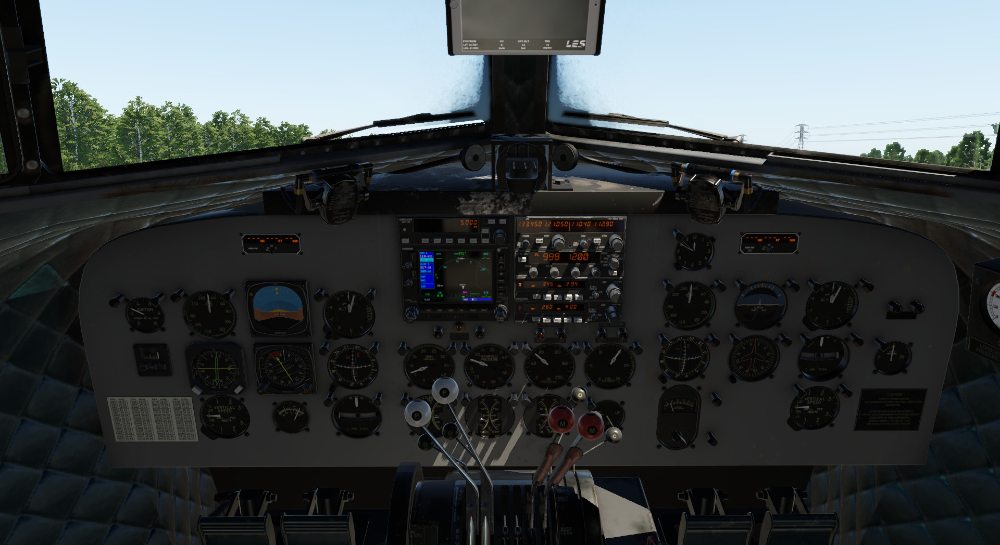

# Introduction

This version has an updated, more modern panel, with newer instruments and radios.

This variation represents updated DC-3 aircraft with newer instruments, and radios/avionics.
The panel layout was based, mostly but not fully, on Breitling's DC-3, HB-IRJ.

This variation provides to the pilot a fully IFR capable aircraft, to perform all kinds all instrument procedures. This, though, does not deduct anything from the experience that you are operate a DC-3!

The rest of the systems remain similar to the *Classic* variant, though they have tuned accordingly to facilitate the new panel.

[//]: # (Links: [Radio manuals]&#40;https://www.bendixking.com/content/dam/bendixking/en/documents/downloads/006-18110-0000_5-Pilot-s-Guide.pdf&#41;)