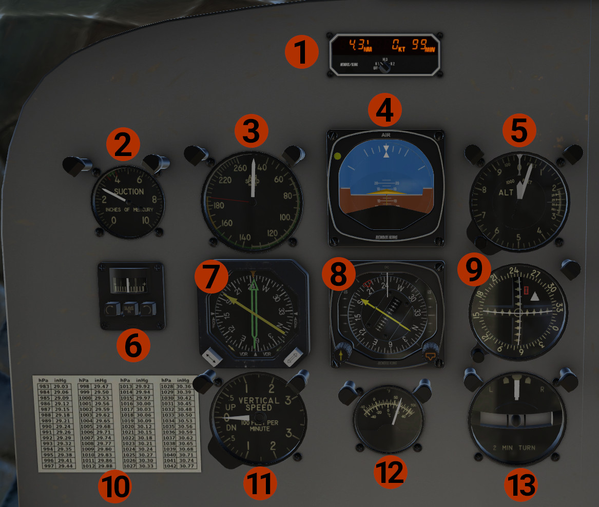

# Pilot's Panel

1. **KDI-572:** DME indicator for the pilot. Displays distance, speed, and time for the 2 Nav stations. Operation:
Use the link for the [Official Documentation](https://www.bendixking.com/content/dam/bendixking/en/documents/downloads/006-08420-0003_3-kdi-572-pilot-guide.pdf).
    
    - **OFF:** Turns the unit OFF.
    - **N1:** Display data for NAV1 tuned station. Display dashes if no station is received.
    - **HLD:** When we turn the knob from N1 to HLD, tunes DME to the NAV1 radio and displays the NAV1 data. 
    If we change frequency in the NAV1 radio, the DME will still display NAV1 data. The same will happen if we turn the knob from
    N2 to HLD, but for NAV2. When the HLD mode holds NAV1 data, **1H** is displayed, and when holds NAV2 data, **H2** is displayed.
    - **N2:** Display data for NAV2 tuned station.

2. **Suction Pressure Indicator:** Shows the pressure of the vacuum system.
3. **Airspeed Indicator** in knots.
4. **Attitude Indicator**.
5. **Altimeter**.
6. **KA51 Slaving Accessory:** Displays the difference in heading between KI525 HSI displayed heading and actual aircraft heading.
When the **SLAVE IN** button is *IN*, the KI525 HSI heading card is slaved. When is *OUT*, the heading card is in free mode.
In this mode, use the left and right button to align the heading card.
7. **KNI-582 RMI:** Displays bearings, #1 needle (yellow) to NAV1 or ADF1 stations, #2 needle (green) to NAV2 or ADF2 stations, depending on the selection of their respective buttons.
A **HDG** flag is displayed when the heading is invalid.
8. **KI-525 HSI:** A **HDG** flag is displayed when the heading is invalid. A **NAV** flag is displayed when no signal is received on the NAV1 radio.
Use the left knob to set the course, and the right knob to set the heading. When the NAV1 is tuned on an ILS frequency, 2 yellow pointers
over the left and right vertical scales are displayed when glideslope signal is received, to show the vertical situation.
9. **Course Indicator:** Displays NAV2 lateral and vertical deviations.
10. **Baro Table:** Conversion table between inHg and hPa. Click to get a pop out window.
11. **Vertical Speed Indicator (VSI)**.
12. **Outside Air Temperature**.
13. **Turn & Slip Indicator**.