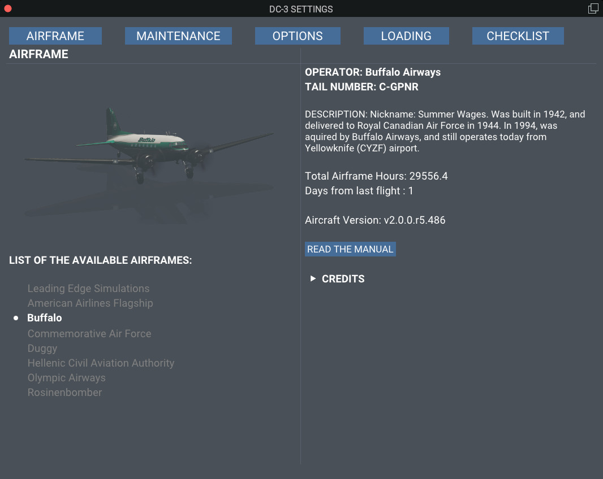
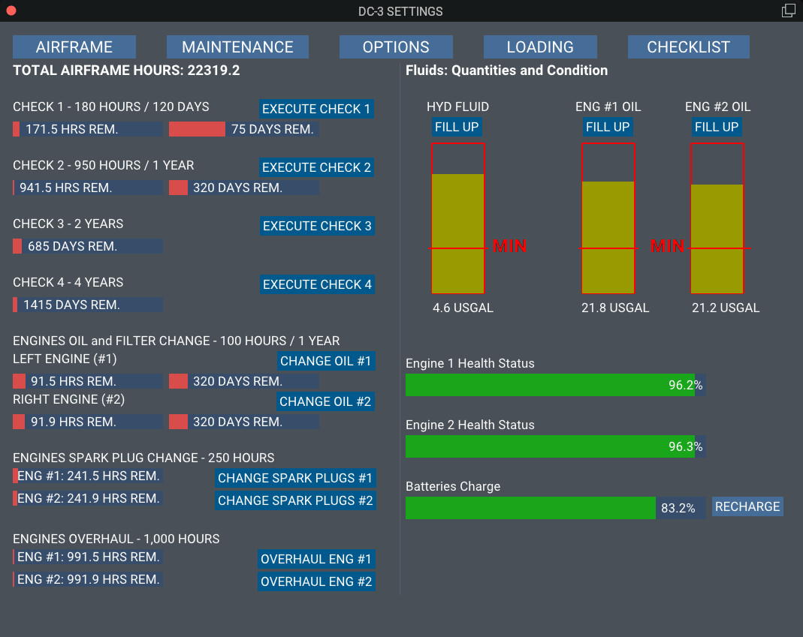
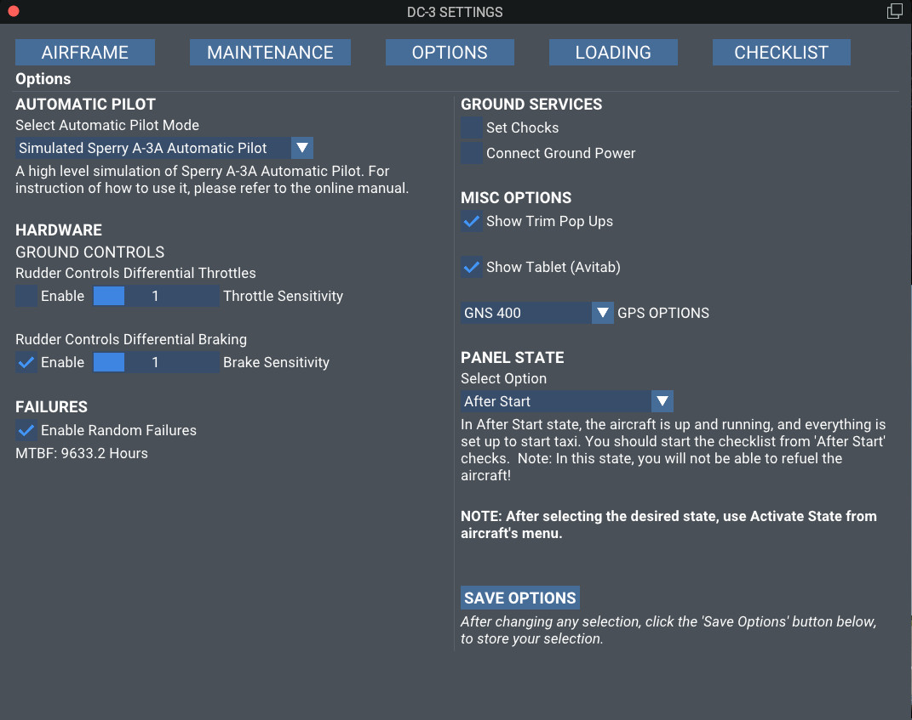
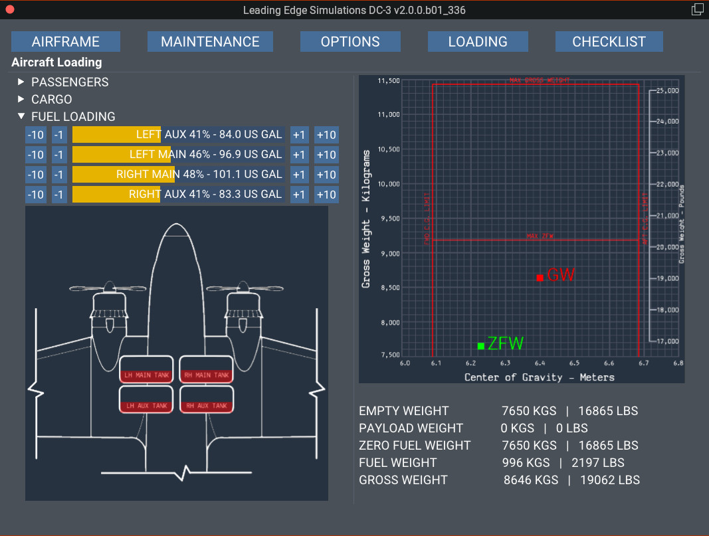
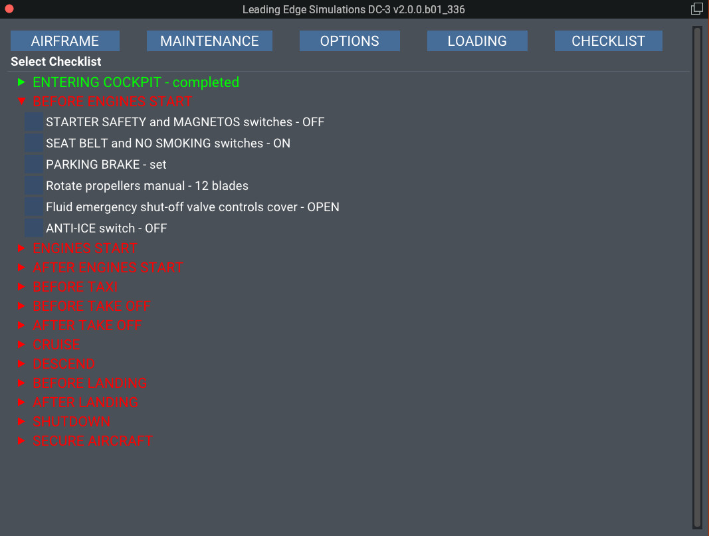

# User Interface

The user interface is the means for the user to interact with various faces of the flight, and as well as set various options, aircraft loading, etc.
It is divided in 5 "tabs" or pages.

## AIRFRAME
Gives the user info about the aircraft, the available liveries, and Credits.
Also, there is a button **READ THE MANUAL**, to launch this site in your browser.

## MAINTENANCE
Provides a picture of aircraft's maintenance condition. More information in the maintenance page.
!!! hint "INFO"
    While the aircraft in operation, ie. engine(s) running, maintenance execute buttons, will not be available.

## OPTIONS
Here you can set the various options. Make sure that you press the **SAVE** button after selecting your option to be stored for the next flight.

### Automatic Pilot
For the Classic aircraft, there are 2 option to select. Read more in the [Automatic Pilot](docs/classic/autopilot.md). 
The Modern aircraft has installed the Bendix/King KAP-140, with altitude preselect.

### Hardware Options
To help you with the taxi, there are 2 option to select.

   - If you don't own 2 throttles, you can select the first option, and set the sensitivity as you like. This option reads your throttle position and depending on your rudder input, adjust the throttles. For example, to turn left, the left engine's throttles is retracted and the right engine's throttle is advanced.
   - If you don't own rudder pedal with toe braking, you can select the second option, and using the rudder, differential brakes will be applied. At very low speeds, you might need to add a little power, while turning. 

### Failures
While the aircraft has build in failures in case you don't manipulate the aircraft with the proper care, you can also select random failures provided by X-Plane. The Mean Time Between Failures (MBTF) is based on aircraft's maintenance status. 

### Ground Services
You can set chocks and connect the GPU. If you connect the GPU, also chocks are set automatically. Disconnecting the GPU, **will not** remove the chocks. Also chocks will be automatically installed, if you load the aircraft in any state, except **After Start**.

### Misc Options
Selecting the **Show Trim Pop Ups**, will display, on the left lower corner of you screen, a pop up with the trim settings for pitch, roll, and yaw, as well the tail wheel lock status.
If you select the **Show Tablet** option, a tablet with the Avitab will be shown. Requires the [Avitab plugin](https://github.com/fpw/avitab/releases).

### GPS Options
The modern aircraft comes with the X-Plane's G530 as standard. RXP GNS530 is supported, and you must activate through RXP's menu.

The classic aircraft offers 3 GPS options.

  - *GNS400:* This is based on X-Plane's G430, but does not have the controls for COM1/NAV1.
  - *RealityXP GNS400*
  - *RealityXP GTN650*

!!! hint "INFO"
    GPS's for the Classic aircraft, are only for advisory purposes. They are not connected in any way with aircraft's automatic pilot or navigation capabilities.

### Panel State Options

  - *Cold and Dark:* The aircraft will load with all systems off.
  - *Powered:* All electrical systems will be on.
  - *After Start:* All ready to start taxiing. But not forget to do the checks. Always read the checklist!
  - *Persistent:* The aircraft will load as you left her, after the last flight. By aware that each livery/airframe keeps track of her own status. Read more at the Liveries Concept page.

## LOADING
Here, on the left side, you can load the aircraft with passengers, cargo, and fuel.
On the right side, you can monitor the CG, and the weights.

!!! danger "WARNING"
    Fuel loading is not possible with the engines running, or if you are in flight mode in FS Economy!

## CHECKLIST
A complete checklist, adapted for our aircraft. 

Click the small arrow on the left to open a checklist, and check the items. When a checklist is completed, the color of the specific checklist will turn from white to cyan, and *completed* is added. This allows for a quick overview which checklist is complete and which not.

The **RESET ALL CHECKLISTS** on the top will reset all checklist, and a **RESET CHECKLIST** button to reset each checklist individually. 

