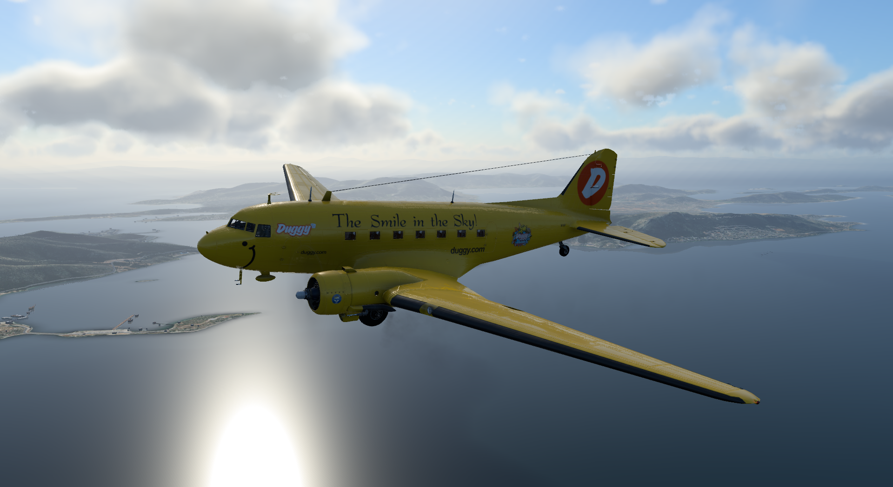

# Introduction

Welcome to Leading Edge Simulations Douglas DC-3, version 2.0. This version of the DC-3 is a complete rework of the previous version.

## Aircraft Types

This DC-3 product package includes 2 different variations. 

The first, ["Classic"](docs/classic/classic.md), is based on the early production DC-3 layouts, from late 1930's to mid 1940's era.

The second, ["Modern"](docs/modern/modern.md), is based on aircraft that have been retrofitted with more modern instruments and avionics.

## Features List

- Fully redone 3D model, with PBR materials, and 4K textures.
- Fully developed custom systems. Some highlights:
    - Electric system: Battery loses capacity when the aircraft is not flown. Generators' output is temperature dependent. Relays will not connect generators (even with switches on), if the output voltage is not above a certain voltage. Voltage output matches real aircraft's rpm-voltage relationship.
    - Automatic Pilot: There are 2 options, a simplified version that uses X-Plane commands to simulate the Sperry A-3 Automatic pilot, and a custom one, simulates the A-3 operation.
    - Navigation: Typical WWII era VOR and ADF radios. You can add a GPS unit (X-Plane's 430, RXP GNS 430, or RXP GTN 650), but they are not provide any guidance.
    - Hydraulics: Extended simulation of the 2 hydraulic systems' operation.
    - Engines: Fully simulated mixture controls (auto-lean, auto-rich, emergency). Custom auto-feather mechanism. Oil consumption depending on engines' health. Engines power output is
    depended on engines' health.
    - Fuel system: Fully simulated loading, controls, and indications.
- Modern UI (User Interface) with pages:
    - Airframe: Overview of the available airframes, with information about the current airframe.
    - Maintenance: Overview of aircraft’s health situation, with controls to perform scheduled maintenance.
    - Options: Select various items, like automatic pilot type, hardware controls, ground services, panel states, misc options.
    - Loading: Controls to load the aircraft with passengers, cargo, and fuel. View CG on the CG chart.
    - Checklist: Easy to use checklist to help you with your flight tasks.
- Particle system effects.
- Airframe system. Each livery is a unique different airframe, and changing liveries is like changing airframes! Options, maintenance logs, states, are following each one separately.
- Maintenance system. Every aircraft operation is tracked and logged. Aircraft's condition can be monitored through UI, and perform required maintenance tasks.
- Fully immersive fmod sounds.

The aircraft is compatible with X-Plane 12 and will be supported through X-Plane 12 run.

## Things not in the v2.0.0
Systems not fully developed, but will be developed farther, throughout DC-3 v2 run:

### All aircraft
- **Hydraulic system:** All indication are correct, but until now X-Plane does not allow deep interaction with the system. 
- **Anti-ice/De-ice systems:** All systems are included, but not fully simulated, yet.
- **Hardware Support:** Currently we support the basic hardware, joystick/yoke, throttle, mouse, and keyboard. We are planning to add support to more specific hardware options after release, that will allow more realistic procedures.

### Classic
- **Sperry Autopilot:** The basic operations is included, except the 'heading mode'.

[//]: # ()
[//]: # (### Modern)

[//]: # (## Purchase)

[//]: # (You can purchase this aircraft at [X-Aviation store]&#40;https://www.x-aviation.com/catalog/product_info.php/douglas-p-84&#41;.)

